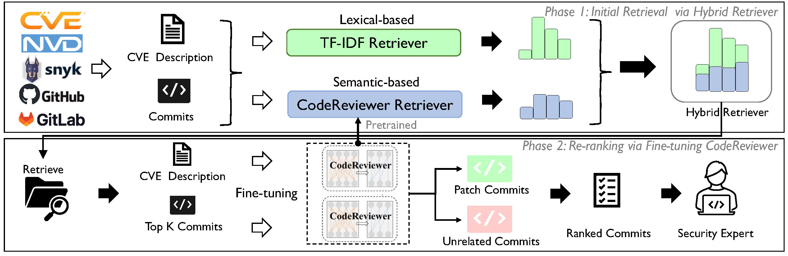

# PatchFinder [](https://arxiv.org/abs/2407.17065) [](https://sites.google.com/view/issta2024-patchfinder/home) [](https://2024.issta.org/)


PatchFinder: A Two-Phase Approach to Security Patch Tracing for Disclosed Vulnerabilities in Open Source Software


## Overview
PatchFinder operates in two distinct phases:

1. Efficient **initial retrieval** via Hybrid Retriever.
2. Powerful **re-ranking** via fine-tuning CodeReviewer.

## Abstract
Open source software (OSS) vulnerabilities are increasingly prevalent, emphasizing the importance of security patches. However, in widely used security platforms like NVD, a substantial number of CVE records still lack trace links to patches. Although rank-based approaches have been proposed for security patch tracing, they heavily rely on handcrafted features in a single-step framework, which limits their effectiveness.

In this paper, we propose PatchFinder, a two-phase framework with end-to-end correlation learning for better-tracing security patches. In the initial retrieval phase, we employ a patch retriever to account for both lexical and semantic matching based on the raw source code, an efficient and powerful information retrieval method, to narrow down the search space by extracting those commits as candidates that are similar to the CVE descriptions. Afterward, in the re-ranking phase, we design an end-to-end architecture under the supervised fine-tuning paradigm for learning the semantic correlations between CVE descriptions and commits. In this way, we can automatically rank the candidates based on their correlation scores while maintaining low computation overhead. We evaluated our system against 4,789 CVEs from 532 OSS projects. The results are highly promising: PatchFinder achieves a Recall@10 of 80.63% and a Mean Reciprocal Rank (MRR) of 0.7951. Moreover, the manual effort@10 required is curtailed to 2.77, marking a 2.03 times improvement over current leading methods. 
When applying PatchFinder in practice, we initially identified 533 patch commits (average rank at 1.65) and submitted them to the official, 482 of which have been confirmed by CVE Numbering Authorities.




## Structure of this repository

```bash
.
|-- FN_Analysis # for our false negative analysis
|-- LICENSE
|-- PatchFinder # the main codebase, containing the implementation of our approach
|-- Prestudy_CodeLlama # the codebase for the prestudy
|-- README.md
|-- RQ1_Baselines # the codebase for RQ1
|-- RQ3 # the codebase for RQ3
|-- data # the data used in our paper
`-- metrics # the final metrics of our approach

```

### Steps to reproduce the results

1. For Phase-1, you are supposed to run the code of `TF-IDF` in the `PatchFinder` folder and CRScore to get the initial retrieval results. 

2. After that, you can get the top-100 candidates for each CVE, which will be used as the input for Phase-2. Remember, you need to retrieve the data for training, validation, and testing from the `data` folder in this step.

3. For Phase-2, you can run the code of `CodeReviewer` in the `PatchFinder` folder to fine-tune the model and get the final results.

4. Finally, you can get the final metrics by running the code in the `metrics` folder.

## Cite us

### BibTeX

```
@inproceedings{li2024patchfinder,
  title={PatchFinder: A Two-Phase Approach to Security Patch Tracing for Disclosed Vulnerabilities in Open Source Software},
  author={Li, Kaixuan and Zhang, Jian and Chen, Sen and Liu, Han and Liu, Yang and Chen, Yixiang},
  booktitle={Proceedings of the 33rd ACM SIGSOFT International Symposium on Software Testing and Analysis},
  year={2024}
}
```
## Website

More details can be found on our [website](https://sites.google.com/view/issta2024-patchfinder/home). 

## 
> [!IMPORTANT]
> 
> [**2024.09.04**] We are keeping improving the documents and adding more implementation details. Feel free to share your suggestions for this process by opening issues or PRs. :)

